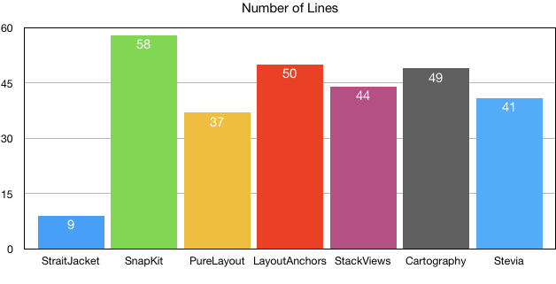
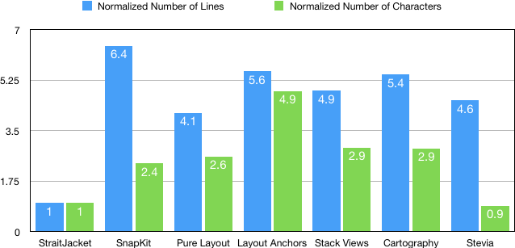

#  StraitJacket
StraitJacket is an object oriented autolayout solution designed for efficient development.  It can create many constraints in one method call and creates only a single type of constraint per method, which increases readability and reduces complexity.

## Why use it
### It will keep devs from hurting themselves
- No xibs or storyboards
- No confusing amalgamations of stackviews and stackview related bugs
- Much faster to write and less error prone than anchor based code and similar libraries
- Much higher skimmability and code density
- Built on top of auto layout
- Manage constraints

## How it works
### It's just swift code

There is no DSL in StraitJacket.  Constraints are created using the `Restraint` object.  Its methods are capable of creating many constraints at once and are all chainable.  `Restraint` is init'd with a root view to holds the created constraints. The `addItems:` method can be used to add multiple views for convenience.

```swift
let aRestraint = Restraint(self.view, items: [titleLabel, usernameTextField, passwordTextField, confirmButton])
    .chainVertically([titleLabel, Space(60).withId("space"), usernameTextField, passwordTextField, confirmButton],
                     in: self.view.layoutMarginsGuide)
```

Constraints are not active upon creation. Don't forget to activate the `Restraint`.  

```swift
aRestraint.activate()
```

Constraints can be created with their respective `withId:` methods and priorities can also be added to individual constraints using the respective `withPriority:` methods.  Constraints can be referred to by id.

```swift
let spaceConstraint = aRestraint.constraintWithId("space")
// do something with the constraint
```

### Restraints are composable
```swift
let restraint1A = Restraint(someView)
// make some constraints
let restraint1B = Restraint(someView)
// make some other constraints
let restraint1 = Restraint(someView, subRestraints: [restraint1A, restraint1B])
restraint1.activate()
// activating restraint1 also activates restraint1A and restraint1B
```
### It can use any NSLayoutConstraint
Any constraint that is referenced can be added to a Restraint.
```swift
let aConstraint: NSLayoutConstraint = // some constraint
aRestraint.addConstraints([aConstraint])
```


## Example
See the [Playground](Playgrounds/ExampleStraitJacket.playground/Contents.swift)


## Comparison
I will compare various autolayout libraries in building the same exact screen as the above example looking at total lines, and total characters to build the same screen.  I will omit spaces, constraint activation calls, return statements, and function declarations.  New lines will be included for line counts since it's important in real world code.  I will strip white spaces for the character count.

### Layout Code Metrics

I find that number of lines of code corresponds inversely to understandability and maintainability, and number of characters corresponds inversely to readability and proportionally to time to write.  Therefore the smaller these metrics, the better.

See the [Comparison](Documentation/Comparison.md) for details.

| | StraitJacket | SnapKit | Pure Layout | Layout Anchors | Stack Views | Cartography | Stevia
:-- | --: | --: | --: | --: | --: | --: | --:
**Total Lines** | 9 | 58 | 37 | 50 | 44 | 49 | 41
**Total Characters** | 678 | 1608 | 1768 | 3307 | 1972 | 1961 | 614




Metrics normalized to StraitJacket

| | StraitJacket | SnapKit | Pure Layout | Layout Anchors | Stack Views | Cartography | Stevia
:-- | --: | --: | --: | --: | --: | --: | --:
**Total Lines/StraitJacket** | 1 | 6.4 | 4.1 | 5.6 | 4.9 | 5.4 | 4.6
**Total Characters/StraitJacket** | 1 | 2.4 | 2.6 | 4.9 | 2.9 | 2.9 | 0.9


